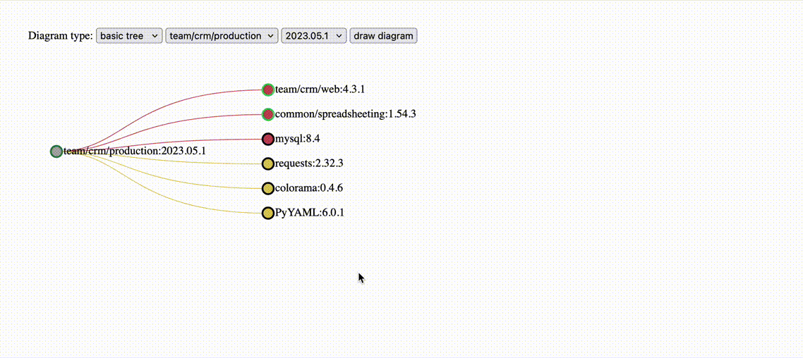

## Deps Visionary

It is a web-tool that gathers info about project dependencies and create tree graph, so that you can keep track of all dependencies in one place



## Deployment

1. Clone repository
2. Run deploy.sh script 

## Settings

Example config [can be viewed here](settings.yml)

All settings defined in `settings.yml` file:
- gitlab:
  - url - URL to your GitLab instance
  - token - authorization token for GitLab. It has to have read_api and read_repository permissions
- pivot_projects - entry point for tool to start processing dependencies
- ignored_projects - projects that won't be processed
- dockerfile_argument_map - if your Dockerfiles have arguments which value is specified in a `docker build` command, you can add value in this map and it will be substituted
```
ARG REGISTRY_PATH
FROM ${REGISTRY_PATH}/team/some_project # ${REGISTRY_PATH} will be substituted to value
```
- docker_suffixes - if your Dockerfiles have containers from projects that ship containers with suffixes, they will be trimmed
```
FROM ${REGISTRY_PATH}/team/some_project/debian # /debian will be trimmed
```
- project_aliases - used primaly when processing dependencies from conanfile.txt or requirements.txt. As tool requires GitLab project path with namespaces, you can specify it here
- redis:
  - url - specifies path to redis instance. By default we assume that redis is deployed locally on a server
  - lock_max_time - TTL of task lock (in minutes)
